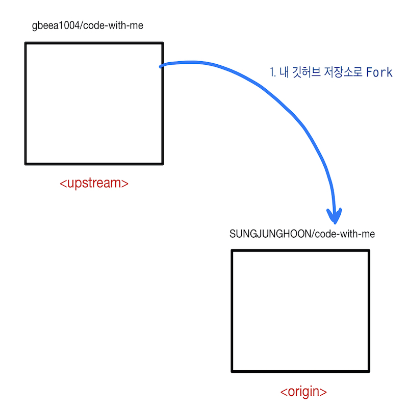
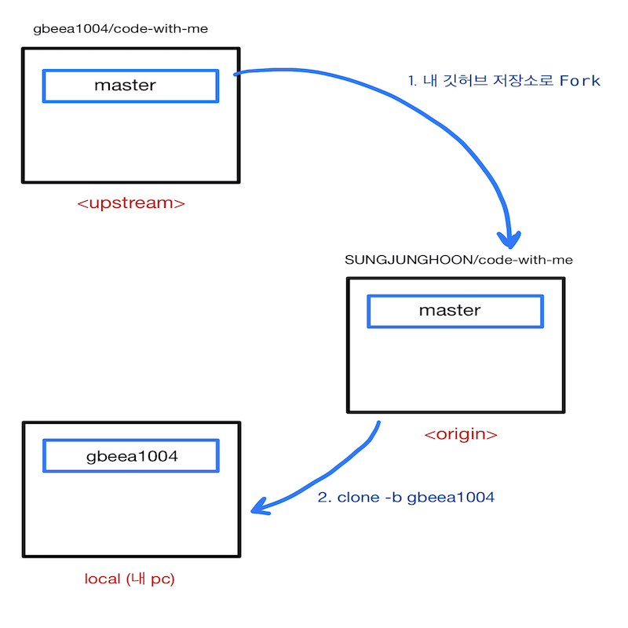
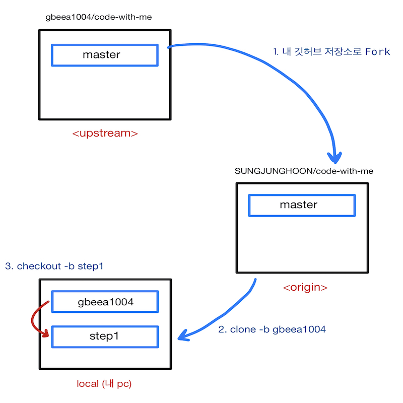
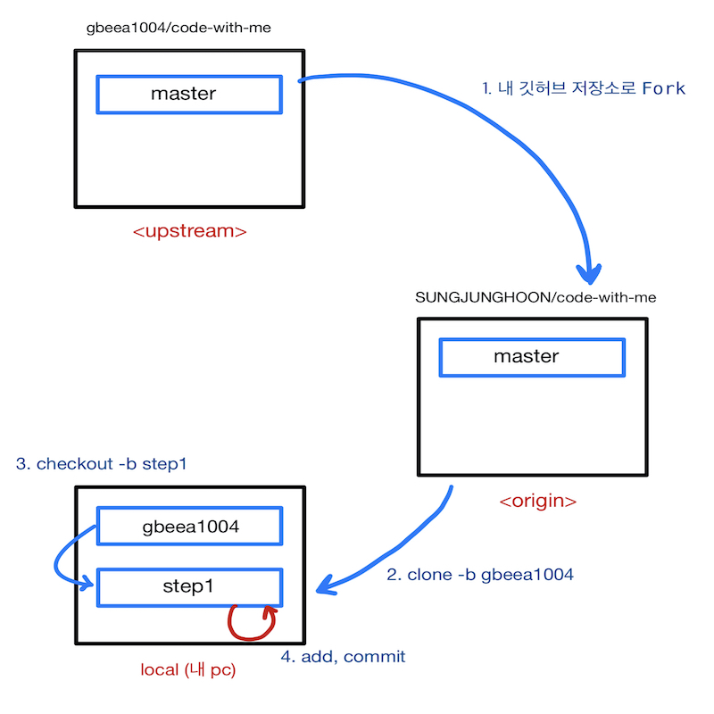
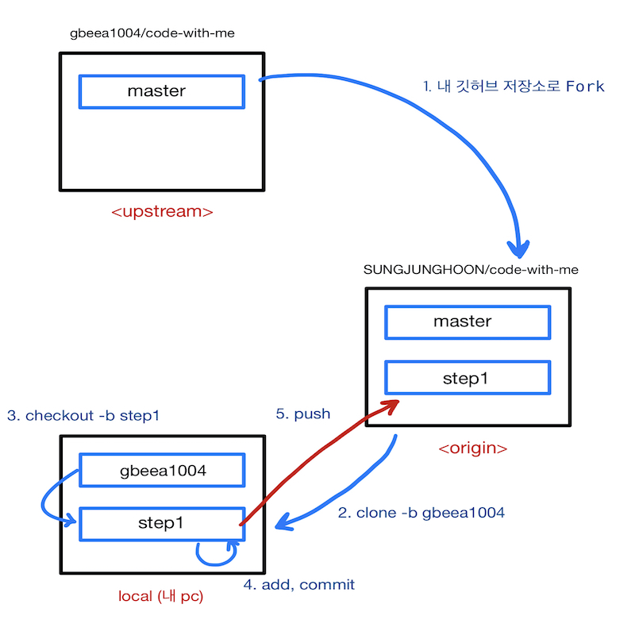
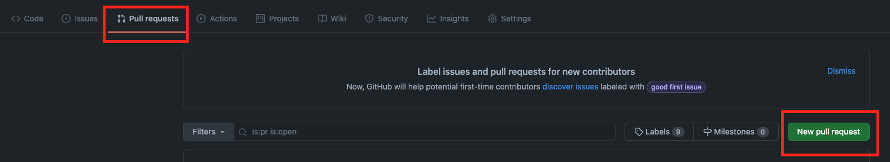
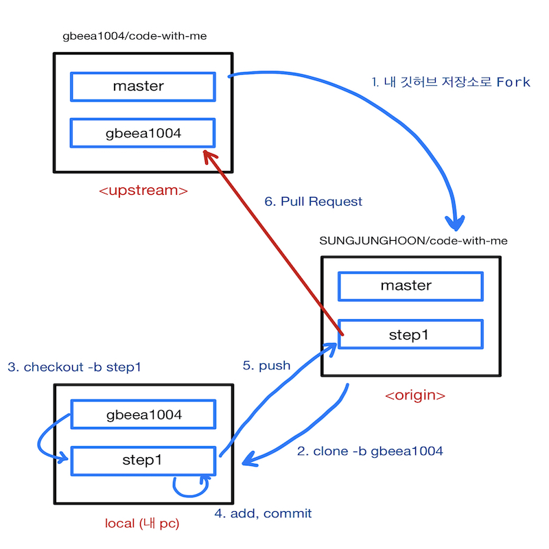
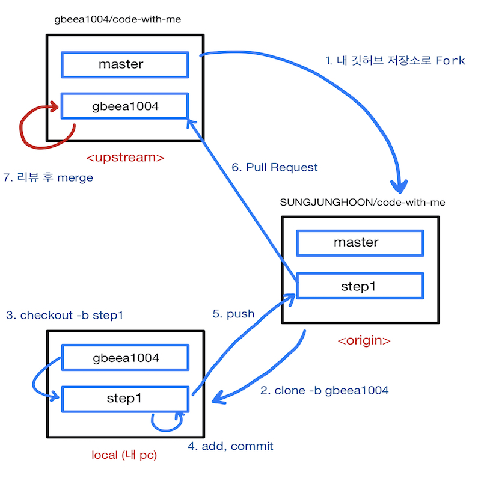

# 2주차
<a id="githubGuide"></a>
## 깃허브 사용 법

### 1. code-with-me 프로젝트를 내 깃허브 저장소로 Fork 한다.


https://github.com/gbeea1004/code-with-me



### 2. 내 저장소에 만들어진 code-with-me 프로젝트를 내 PC로 가져온다.


**GitBash** 에 접속해서 복사할 곳으로 이동한 후

```
cd D:/study
```
위 프로젝트 경로를 복사해서 입력한다.
```
git clone -b {본인_아이디} --single-branch https://github.com/{본인_아이디}/{저장소 아이디}
ex) git clone -b gbeea1004 --single-branch https://github.com/gbeea1004/code-with-me
```

```
cd {저장소 아이디}
ex) cd code-with-me
```



### 3. PC로 가져온 프로젝트를 인텔리제이로 열어준다.

### 4. 기능 구현을 위해 브랜치 생성

```
git checkout -b 브랜치이름
ex) git checkout -b step1
```




### 5. 인텔리제이로 미션 구현 후 add, commit
```
git status (확인)
git add . (변화가 있는 모든 파일 반영)
git commit -m "first commit" (커밋)
```


### 6. 본인의 원격 저장소에 올리기

```
git push origin 브랜치이름
ex) git push origin step1 (origin 저장소의 step1 브랜치에 반영)
```


### 5. 내 깃허브 저장소에 들어가서 Pull Request 를 보낸다. 


> pull request 를 보낼때는 자신의 github 아이디 기준으로 보낸다.<br/> 
> ex) origin step1 브랜치의 내용을 upstream gbeea1004 브랜치로 Pull Request 한다.<br/><br/>
> Pull Request를 통해 피드백을 받으면 코드를 수정한 후 같은 브랜치에 add, commit, push 작업을 반복 후 다시 Pull Request 보낸다.



### 6. 리뷰어가 피드백 마무리 후 upstream 저장소로 merge (내가 하는 작업 아님)


### 7. merge 를 완료했다는 통보를 받으면 브랜치 변경 및 작업 브랜치를 삭제한다.
```
git checkout 본인_아이디
git branch -D 삭제할_브랜치이름
ex) git checkout gbeea1004
ex) git branch -D step1
```

### 8. merge 한 upstream 저장소와 동기화하기 위해 upstream 저장소의 자기 브랜치 추가 (최초 한번만)
```
git remote add -t {본인_아이디} {저장소_별칭} base_저장소_url
ex) git remote add -t gbeea1004 upstream https://github.com/gbeea1004/code-with-me.git
// 위와 같이 upstream 저장소를 추가한 후 전체 remote 저장소 목록을 본다.
git remote -v
```

### 9. upstream 저장소에서 자기 브랜치 가져오기 (또는 갱신하기)
```
git fetch upstream {본인_아이디}
ex) git fetch upstream gbeea1004
```

### 10. upstream 저장소 브랜치와 동기화하기
```
git rebase upstream/본인_아이디
ex) git rebase upstream/gbeea1004
```

### 11. 4 단계부터 진행
```
git checkout -b 브랜치이름
ex) git checkout -b step2
```

### 참고
[코드스쿼드 깃허브 리뷰 과정](https://github.com/code-squad/codesquad-docs/blob/master/codereview/README.md)